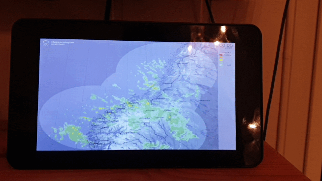

# seaWeatherPi
Raspberry PI processing sketch to show marine weather from YR.no. Perfect for the official raspi 7' touch screen

Shows graphs for windspeed/direction, wave height/direction, sea current strength/direction, water/air temperature, percipitation and weather symbols. 
It also shows an animated percipitation radar view for the previous hour.

Change the two urls in the update() method to change the forcast location.

